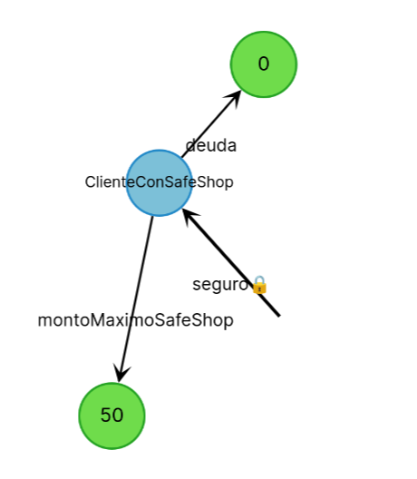

# Clientes de una tarjeta de crédito
 
[](https://github.com/wollok/clientesTarjetaMixin/actions/workflows/ci.yml)

El proyecto cuenta cómo agregar comportamiento a un objeto en forma dinámica.

En el [enunciado original](https://docs.google.com/document/d/1Ijz8Pe-ci6bYwbxIn-VZDV1QcijDy2JuAUQtohNX0oA/edit#), tenemos un cliente de una tarjeta de crédito que tiene un comportamiento muy simple: posee una deuda que se incrementa con cada compra.

El usuario pide los siguientes agregados:

- ciertos clientes se adhieren a un sistema Safe Shop que bloquea las compras por más de un monto determinado
- otros clientes que completan un formulario ingresan a un sistema de puntos por recompensa con cada compra mayor a un monto x.

# Soluciones

Las soluciones posibles que cuenta el apunte son

- agregar dos condicionales dentro de la definición de un cliente
- tener una colección de strategies que ocurren al comprar
- decorar al cliente
- una variante de decorar mediante una colección de strategies al cliente
- descartando de plano la herencia que no permite combinar clientes a secas, clientes con promoción, clientes con safe shop y clientes con safe shop y promoción sin repetir código.

# La variante en Wollok : Mixins

Los mixins de Wollok permiten definir comportamiento sin atarlo a una clase o wko. En este caso dada la clase Cliente

```js
class Cliente {
  var property deuda = 0
  method comprar(monto) {
    deuda = deuda + monto
  }
}
```

sin afectar directamente al cliente generamos dos mixins, uno con cada agregado nuevo:

```js
mixin SafeShop {
  var property montoMaximoSafeShop = 50
  
  method comprar(monto) {
    if (monto > montoMaximoSafeShop) {
      throw new Exception(message = "Debe comprar por menos de " + montoMaximoSafeShop)
    }
    super(monto)
  }
}

mixin Promocion {
  var property puntosPromocion = 0
  
  method comprar(monto) {
    super(monto)
    if (monto > 20) {
      puntosPromocion = puntosPromocion + 15
    }
  }
}
```

El uso de super(monto) no refiere a la herencia, sino al proceso de **linearización** que ocurre con posterioridad, en los tests. El mixin delega a una jerarquía que se completa en tiempo de ejecución, lo que le da una gran flexibilidad (y ciertamente un grado de indirección que puede dificultar el mantenimiento posterior).

# Primera versión

Si queremos modelar un cliente con safe shop podemos definir una clase específica

- que herede el comportamiento de Cliente
- pero que también agregue la funcionalidad del mixin SafeShop

Esto puede hacerse de esta manera:

```javascript
class ClienteConSafeShop inherits SafeShop and Cliente {}
```

Si jugamos un poco en el REPL vemos cómo funciona:

```bash
> const seguro = new ClienteConSafeShop()
> seguro.montoMaximoSafeShop()
50
> seguro.comprar(60)
✗ Evaluation Error!
  wollok.lang.Exception: Debe comprar por menos de 50
    at If [clientes.wlk:15]
    at clientes.SafeShop.comprar(monto) [clientes.wlk:13]
```

La linearización consiste en aplanar la jerarquía considerando mixins y clases para formar el objeto que pertenece a la clase ClienteConSafeShop.


Pero atención, que en memoria solo hay un objeto que toma todas las definiciones (en esto la linearización se asemeja a la herencia):



Aquí vemos que la clase ClienteConSafeShop 

- aplica las definiciones del mixin SafeShop
- y luego hereda de la clase Cliente

Los mixins no pueden instanciarse, ni tienen constructores, su finalidad es participar en objetos que no tienen una jerarquía común.

Como consecuencia, en la clase ClienteConSafeShop tenemos acceso a las referencias de Cliente, pero también a las que define SafeShop:


```javascript
class ClienteConSafeShop inherits SafeShop and Cliente {
  method deudaEnRojo() = deuda - montoMaximoSafeShop 
}
```

Lo probamos en la consola

```bash
> const seguro = new ClienteConSafeShop()
> seguro.deudaEnRojo()
-50
```

# Combinaciones de condiciones comerciales

Para combinar Safe Shop y Promocion podemos crear una clase ad-hoc:

```javascript
class ClienteMixto inherits Promocion and SafeShop and Cliente { }
```

Nuevamente hacemos la prueba en la consola REPL:

```bash
Wollok interactive console (type "quit" to quit):
> const mixto = new ClienteMixto()
> mixto.comprar(60)
✗ Evaluation Error!
  wollok.lang.Exception: Debe comprar por menos de 50
    at If [clientes.wlk:15]
    at clientes.SafeShop.comprar(monto) [clientes.wlk:13]
    at clientes.Promocion.comprar(monto) [clientes.wlk:27]
> mixto.comprar(40)
> mixto.puntosPromocion()
15
```

El proceso de linearización agrega el comportamiento de promoción, safe shop y cliente en el mismo orden en que se define la clase:

```javascript
class ClienteMixto inherits Promocion and SafeShop and Cliente { }
```


El lector puede insertar console.println para comprobar cómo funciona.

## Reglas para utilizar inherits en Wollok

- primero los mixines, por último la superclase (es opcional): una clase puede tomar definiciones de tantos mixines como quiera. 

```wollok
class A {}
mixin M1 {}
mixin M2 {}
class C inherits M1 and M2 and A {} // CORRECTO: la superclase de C es A
class C2 inherits M1 and M2 {}      // CORRECTO: la superclase de C2 es Object
```

- no se puede tener más de una superclase en la definición inherits

```wollok
class A {}
class B {}
class C inherits A and B {} // INCORRECTO: solo puede heredar de A o B
```

- no se puede entremezclar mixines y superclase, la superclase debe estar al final de la definición.

```wollok
class A {}
mixin M1 {}
mixin M2 {}
class C inherits M1 and A and M2 {}  // INCORRECTO: la superclase A debe estar al final
class C2 inherits A and M1 and M2 {} // INCORRECTO: la superclase A debe estar al final
class C inherits M1 and M2 and A {}  // CORRECTO
```

- el orden en el que se ejecutan los métodos es el mismo que se escribe la linearización, en el caso de ClienteConSafeShop es primero ClienteConSafeShop, luego SafeShop y por último Cliente.

# Implementaciones similares

Los __traits__ de Scala funcionan de forma análoga a los mixins de Wollok. Les dejamos [un link](http://docs.scala-lang.org/tour/traits.html) a la documentación oficial.

La creación de clases puede resultar un tanto tediosa cuando no necesitamos agregar funcionalidad extra, sino simplemente construir un objeto que tenga promoción, safe shop, ambos o ninguno de esos agregados. Afortunadamente Wollok prevé este tipo de escenarios, que vamos a ver a continuación.

# Testeo unitario - creación de instancias ad-hoc

En el test puede verse cómo crear un objeto cliente con safe shop y otro que combina ambos mixins:

```javascript
describe "tests de clientes" {
  const clienteSafeShop = 
    object 
      inherits SafeShop(montoMaximoSafeShop = 20) 
      and Cliente(deuda = 20) {}

  const clienteSafePromo = 
    object 
      inherits SafeShop(montoMaximoSafeShop = 70)
      and Promocion
      and Cliente {}
```

Los mixins no son solo polimórficos con el cliente, también agregan comportamiento y propiedades, como se puede ver en este test que verifica los puntos de promoción:

```javascript
test "cliente con safe shop y promoción compra, valida y suma puntos promo" {
  clienteSafePromo.comprar(25)
  assert.equals(15, clienteSafePromo.puntosPromocion())
}
```

Por otra parte, podemos estar seguros que un cliente con safe shop y promoción no suma los puntos de promoción si el mixin de safe shop detecta que sobrepasó el máximo permitido, ya que el orden de las delegaciones con super está bien implementado:

```javascript
test "cliente con safe shop y promoción no puede comprar por mucho" {
  assert.throwsExceptionWithMessage("Debe comprar por menos de 70", { clienteSafePromo.comprar(150) })
  assert.equals(0, clienteSafePromo.puntosPromocion())
}
```

# Más información

Pueden verla en [este link](http://www.wollok.org/documentacion/conceptos/), ingresando a la solapa "Avanzados".
